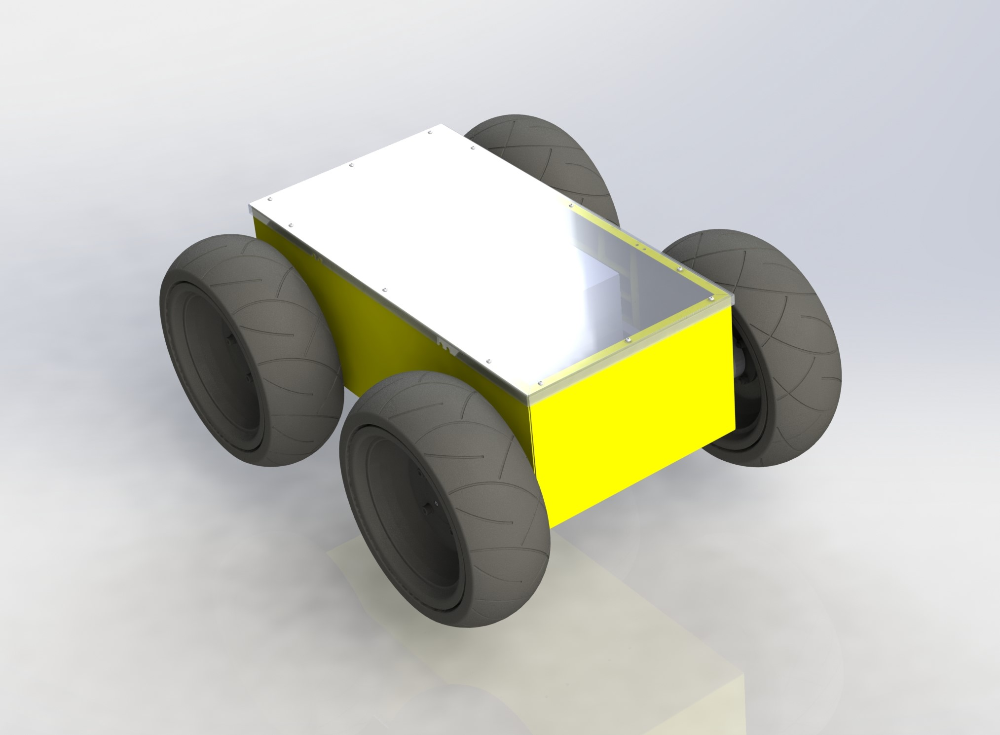

<h1> Vinebot Hardware </h1>

Design and reference documents for the vine scanning robot platforms Genie and Matilda. No binary file documents will be kept here such as electrical/mechanical CAD and  simulation files. These will be kept on our local MaaraTech research drive.

 

<i>Fig 1: Base platform chassis CAD model render</i>
