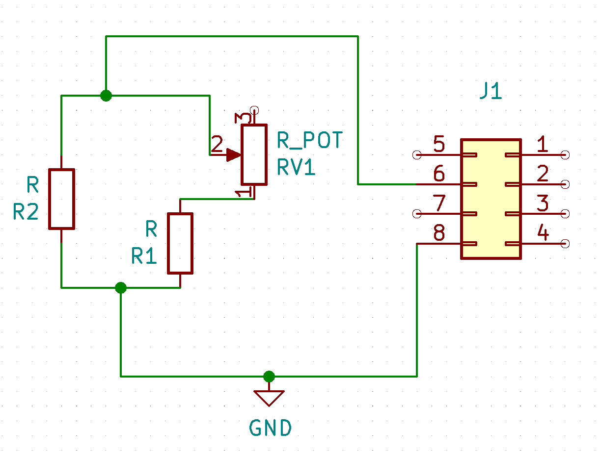

<h1>i7A based power supplies</h1>

All accessories on the platform not using the battery voltage use i7A33A-C01-EVK-S1 (https://product.tdk.com/en/search/power/switching-power/pwr-acc/info?part_no=i7A33A-C01-EVK-S1) buck converter development boards.

The directory ../i7A_Dev_Daughter/ contains the daughter board which attaches on CN1 and replaces the trim pot (VR1 on dev board) to give finer resolution within the desired adjustment range.

From the datasheet: $$R_{up}={F\over{V_{o,up}-V_{o,nom}}}-G$$

For the i7A4W033A033V (module used in the i7A33A-C01-EVK-S1 dev board), $F=16400, G=750, V_{o,nom} = 3.28$.  
This gives an $R_{up}$ of $1.13k\Omega$ for a desired output ($V_{o,up})$ of 12V, and $293\Omega$ for a desired output of 19V.

 

In the above schematic, for 12V, $r_2=2500\Omega$, $r_1=1800\Omega$, and $r_{pot}=500\Omega$.  
For 19V, $r_2=600\Omega$, $r_1=560\Omega$, and $r_{pot}=100\Omega$.
